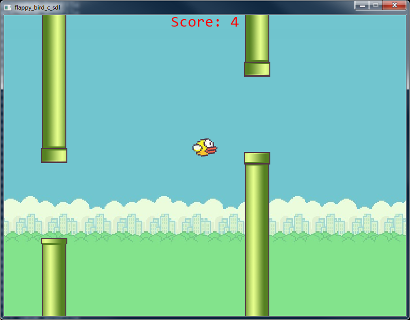
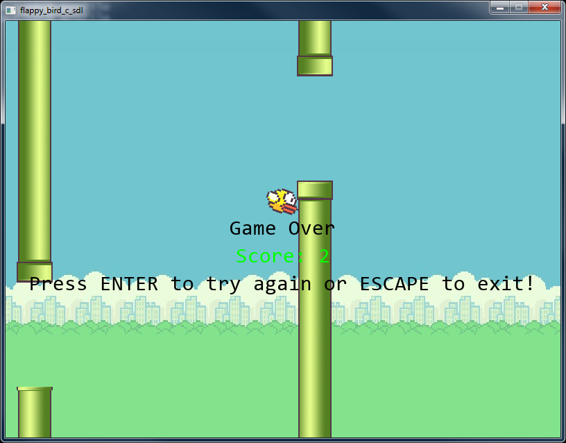
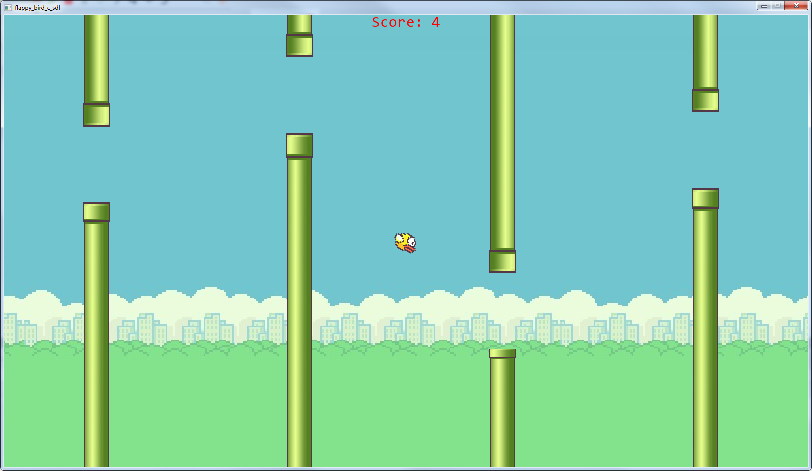

Flappy Bird using Pure C & SDL2

## How to run? 
> **Windows**: Open folder /bin and run program.exe.  
> **Linux**: You must to compile all files.

## How to compile?
> **Windows**: Just run compile_and_run.bat  
> **Linux**: Open terminal in root folder with file 'Makefile' and type in 'make all', then just run /bin/program.  
Warning: I was testing Makefile only on Windows 7, 'make clean' will be not working on Linux!

## Screenshots

